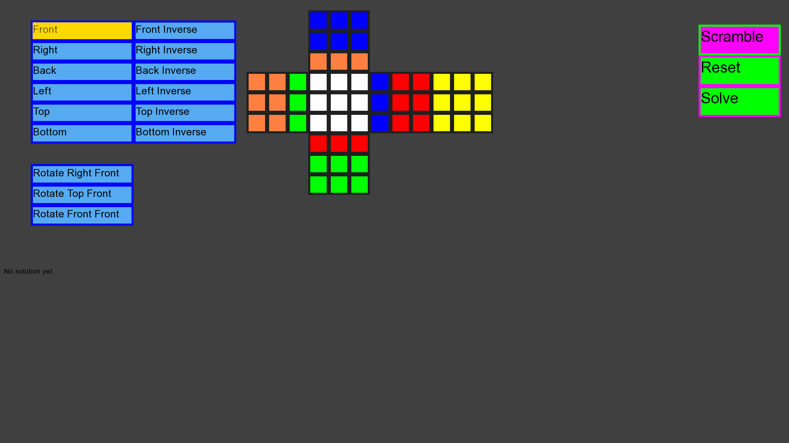
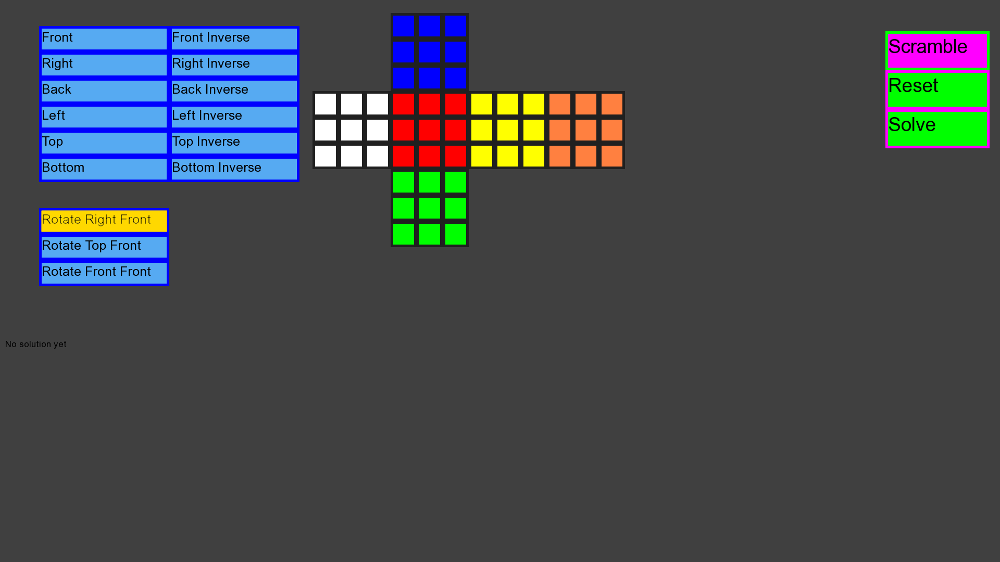
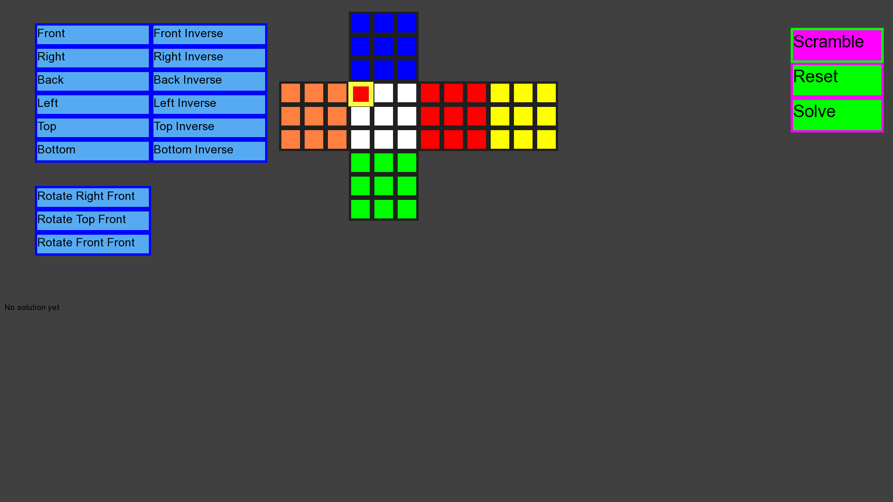
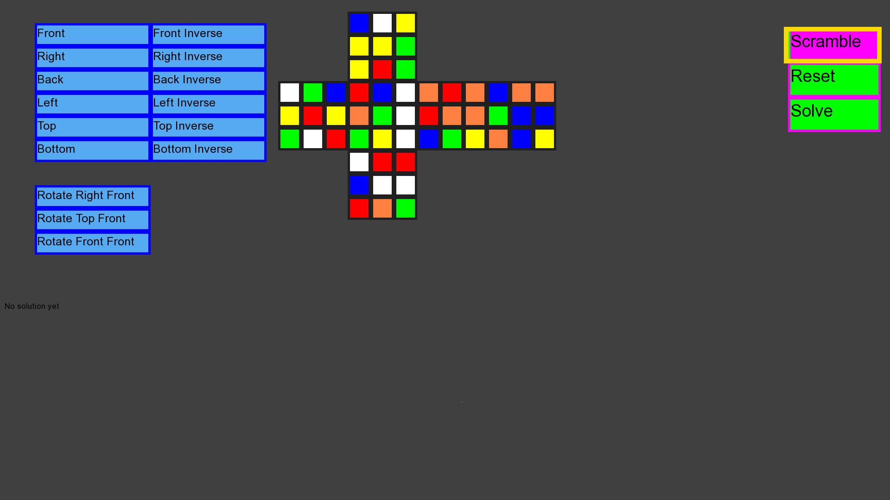
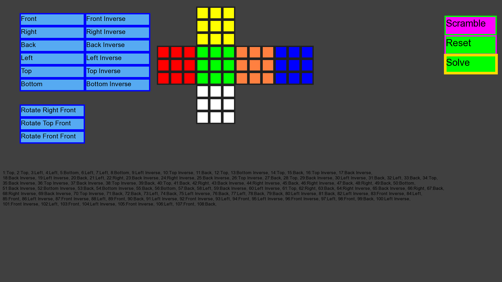

# RubiksCube
An open-ended windows application which displays a Rubik's cube being solved given a valid cube from a user.

The executable begins by showing a user a basic rubik's cube set out as seen in figure 1. The white face is initially considered the `Front` side due to its alignment. To its right are the `Right` side in blue and the `Back` side in yellow sides. Above the white face is the top face in orange and below is the bottom side in red. and a set of buttons to interact with as shown in Figure 1.

   
  Figure 1: The opening screen of the Rubik's cube solver

The user can choose to use the left buttons, interact with the cube squares directly or scramble the cube as shown in the next 4 images.

   
  Figure 2: After pressing the highlighted `Front` button, the cube will rotate it's frontside clockwise. This will in turn affect the top, bottom, right, and bottom side the same way it would as if you had turned a rubik's cube's front side clockwise. When the back side is rotated clockwise, it is with respect to you facing it. Therefore it is inverse of what you would expect if you don't turn the cube around first.

   
  Figure 3: Clicking the Rotate Right Front button will rotate the right of the cube to the front as if you, a user with a rubiks cube did the same thing.

   
  Figure 4: Left clicking a square will change its colour as shown here. Right clicking it will also change its colour the opposite way.

   
  Figure 5: Clicking the scambled button will scramble the cube by using hundreds of valid cube movements. That way the cube that is made will always be able to be solved.

   
  Figure 6: Finally clicking the solve button will solve the cube, remove redundancies moves it made while finding it, and finally show the user how it is solved on the cube move by move. It will also be displayed below.

## Version 1.0 
(Commit 36226e0f325396eb4b9d75c30bb032b830e82d40)
